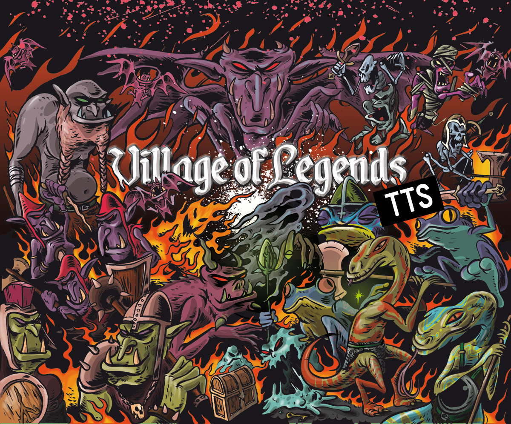

# Village of Legends - Steam TTS workshop

Tabletop Simulator Workshop for [Village of Legends boardgame](https://www.pelotology.com). 

You can:

- buy the physical game [here](https://www.pelotology.com/shop)
- find the rules of the game [here](https://www.pelotology.com/rules)
- watch a gameplay of the base game [here](https://www.youtube.com/watch?v=hs4qvprbbqg)
- watch a video about rules of the base game [here](https://www.youtube.com/watch?v=WD-RvsNV3Ls)
- watch a gameplay of the last expansion [here](https://www.youtube.com/watch?v=Ukg3ufXSlao)

The workshop can be found [here on Steam](https://steamcommunity.com/sharedfiles/filedetails/?id=2472269863)

# Lua source code
The game has been created using [Tabletop Simulator API](https://api.tabletopsimulator.com/).
The source code is in [Lua](https://www.lua.org/pil/1.html) and it is mainly composed by 3 files:

- `Global`: code related to the global environment of the game, handling the players placement and their playing boards and starting decks.
- `Market`: code related to all the market automation, like the shuffling of the main decks and the first deal of the cards of the market. There is also a refill button to add a new card once an item is bought.
- `Player Board`: code related to the player board automation, like the life points counters and the random selection of a character.
